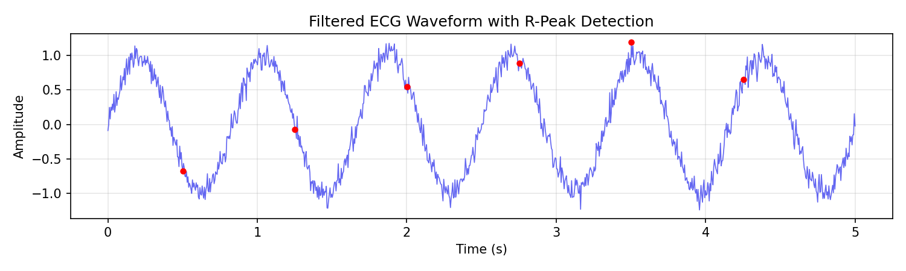
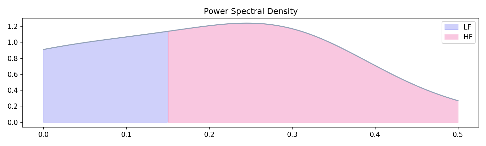

# ECG and HRV Analysis Dashboard

A professional-grade medical clinical reporting tool for ECG signal processing and Heart Rate Variability (HRV) analysis.

## Features
- **Interactive Dashboard**: Built with Streamlit for real-time analysis.
- **Signal Processing**: Advanced ECG filtering and R-peak detection.
- **HRV Metrics**: Calculation of time-domain, frequency-domain, and non-linear metrics.
- **Clinical Reporting**: Automated 2-page PDF report generation with diagnostic waveforms.
- **Visualizations**: Interactive Plotly charts for ECG, PSD, and RR Tachograms.

## Visual Output
### Diagnostic Waveforms
| ECG Waveform | Power Spectral Density |
| :---: | :---: |
|  |  |

### RR Interval Tachogram


## Files
- `OEL1.py`: Core application code.
- `Dashboard_working.mp4`: Video demonstration of the dashboard.
- `John_Doe_HRV_Report.pdf`: Sample clinical report.
- `ECG3.dat`, `ECG4.dat`, etc.: Sample ECG datasets for testing.

## Setup
1. Install dependencies:
   ```bash
   pip install streamlit numpy pandas scipy plotly fpdf matplotlib
   ```
2. Run the application:
   ```bash
   streamlit run OEL1.py
   ```

## License
MIT License
